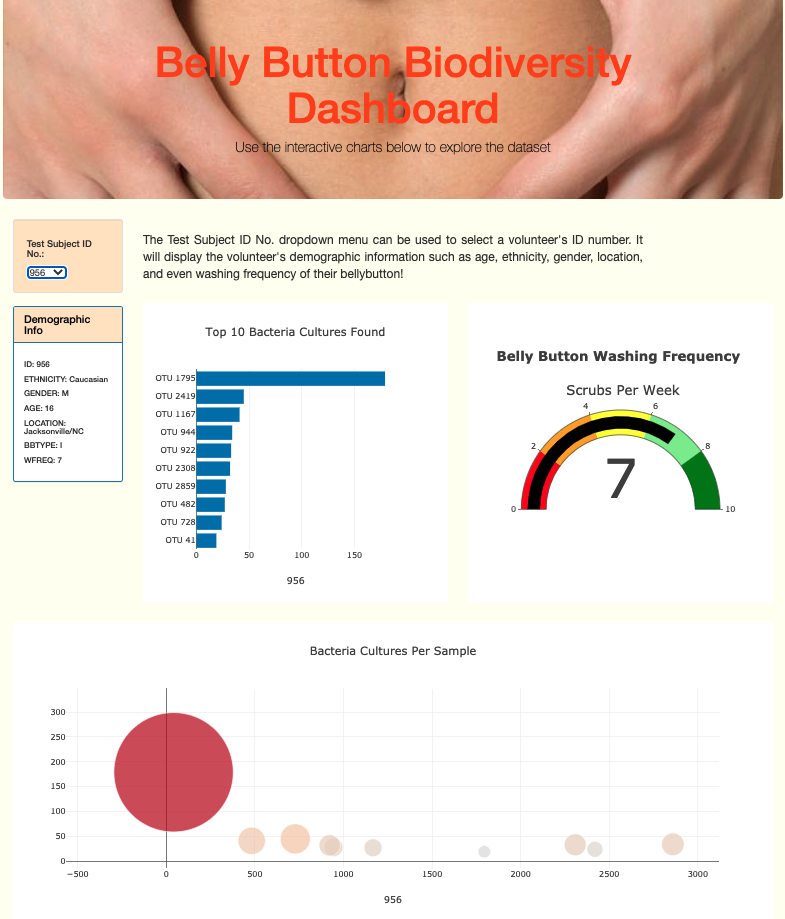

# BellyButton Dashboard

## Overview

The purpose of this assignment was to create an attractive, accessible, and interactive data visualization Web page. JavaScript was used to create interactive features, such as buttons and dropdown menus. Data was retrieved from external sources using D3.json().

## Resources

The following resources were utilized to complete the assignment:

- Plotly.js 
- VS Code
- Web browser console and localhost: 8000
- Mac terminal
- GitHub Pages

## Process

- Creation of basic plots, bar, line, and pie charts with Plotly
- D3.json() to fetch external data
- Functional programming in JavaScript to manipulate data
- JavaScript Math library to manipulate numbers
- Event handlers in JavaScript to enhance interactivity
- Deployment of web page to GitHub Pages 

## Result

Note: When we click on dropdown menu, the ID of the volunteer displays on x-axis of bar and bubble chart.

### Fig.1

https://jacqueline-esbri.github.io/BellyButton_Dashboard/
